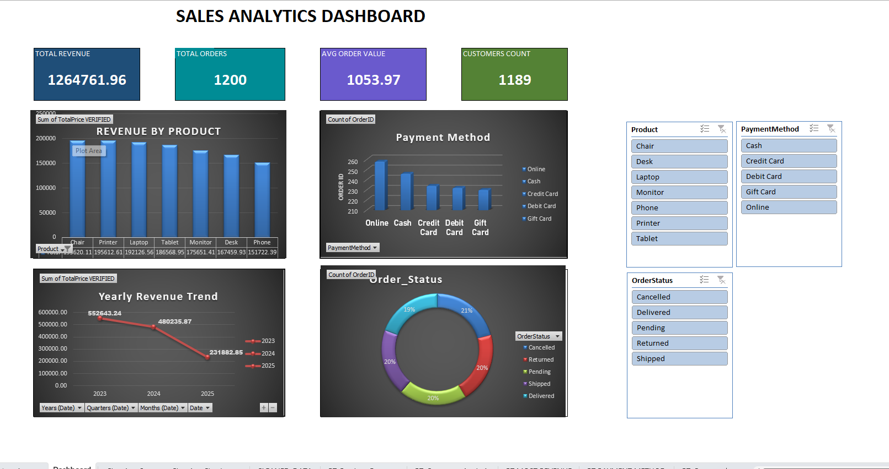

# 📊 Sales Analytics Dashboard – Excel

## 📌 Project Overview

An interactive Sales Analytics Dashboard created using Microsoft Excel.

This project focuses on cleaning raw sales data, analyzing sales performance, and presenting key business insights through an interactive dashboard.

## 🎯 Project Objectives

- Clean and prepare raw sales data
- Identify and handle missing values
- Remove duplicate records
- Correct incorrect data formats
- Standardize text values
- Analyze sales performance
- Create an interactive Excel dashboard

## 🧹 Data Cleaning

The dataset was cleaned by:

- Identifying missing and blank values
- Handling missing coupon values
- Removing duplicate records
- Standardizing text values
- Correcting date formats
- Correcting numerical formats
- Checking data consistency

## 📊 Dashboard KPIs

| KPI | Value |
|---|---:|
| Total Revenue | 1,264,761.96 |
| Total Orders | 1,200 |
| Average Order Value | 1,053.97 |
| Customer Count | 1,189 |

## 📈 Analysis

The dashboard provides insights into:

- Revenue by Product
- Payment Method Analysis
- Yearly Revenue Trend
- Order Status Distribution
- Customer Analysis
- Product Performance

## 🎛️ Interactive Filters

The dashboard includes Slicers for:

- Product
- Payment Method
- Order Status

These allow users to interactively filter the dashboard and explore different aspects of the sales data.

## 🛠️ Tools & Skills

- Microsoft Excel
- Data Cleaning
- Data Preparation
- PivotTables
- PivotCharts
- Excel Slicers
- Data Analysis
- Data Visualization
- Dashboard Development

## 📷 Dashboard Preview

## 📁 Project Files

- [📊 Sales Analytics Dashboard](Sales_Analytics_Dashboard.xlsx)
- [🖼️ Dashboard Preview](Sales_Analytics_Dashboard.png)

## 💡 Key Learning

This project helped strengthen my practical skills in:

- Data cleaning and preparation
- Excel-based data analysis
- PivotTable and PivotChart analysis
- Interactive dashboard development
- Data visualization
- Business reporting

## 👤 Author

**Kamal Jeet**

Aspiring Data Analyst | SQL | Excel | Power BI | Python
